## Tutorial：Realm Mobile Platform にアクセスするアプリを Xamarin.Forms で作ろう

Swift でやっている Realm Mobile Platform のチュートリアル「[Realm Mobile Platform iOS App Tutorial](https://realm.io/docs/tutorials/realmtasks/)」を Swift ではなく、C# で作ってみましょう。フレームワークには Xamarin.Forms を使用します。

Realm Mobile Platform とはなんぞや？という方は、[公式ページ](https://realm.io/jp/products/realm-mobile-platform/) をご覧ください。

Realm Mobile Platform には Developer Edition があり、無料でオフラインファーストで自動同期の機能を備えたモバイルアプリを構築できます。有償の Professional Edition 以上では、無制限の Realm Functions（いわゆるサーバーレスの実行基盤、Azure Functions／AWS Lambda と同じような機能）が使えたりします。

Realm Mobile Platform のインストールは、公式ドキュメントの [Getting Started with the Realm Mobile Platform](https://realm.io/docs/get-started/) を参照してください。

macOS 用には、ライブラリを含む Realm Object Server（Realm Mobile Platform のサーバーアプリの呼称）が用意されていて[こちら](https://realm.io/docs/get-started/installation/mac/)からダウンロードできます。ダウンロード後、圧縮ファイルを展開しコマンドを実行するだけで動作します。非常に簡単に導入できるため、今回は macOS 版を使用してこのチュートリアルを進めたいと思います。

Linux がある方は Linux にインストールしてアクセスしても良いですし、docker で立てても良いかもしれないですね。

> こっそり私の Azure 環境にハンズオンで Realm Object Server の環境が作れない方に使ってもらうためのインスタンスと Docker コンテナはすでに立ててありますのでない方は仰ってください。

### 事前準備

事前準備として、Realm Object Server を起動し、データを登録する必要があります。

Realm Object Server の展開が終了したら、ルートディレクトリの `start-object-server.command` を実行します。

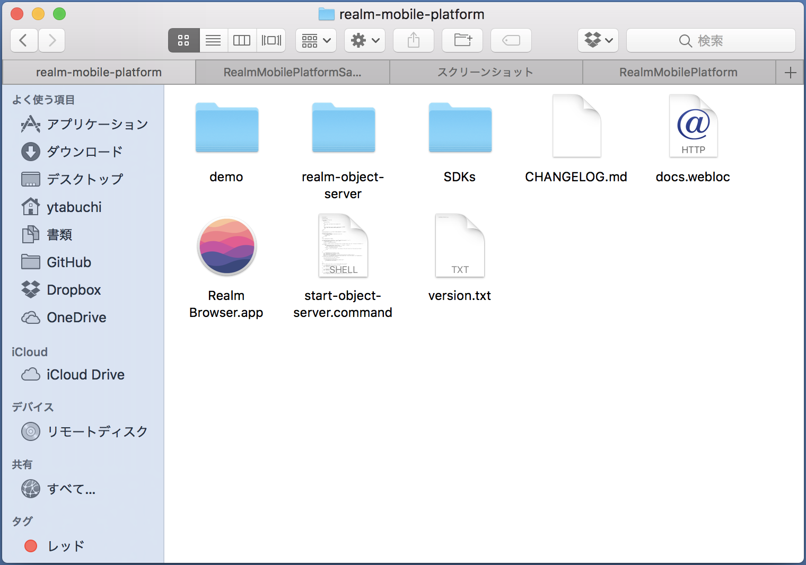

ブラウザが起動し、ログイン画面が表示されます。

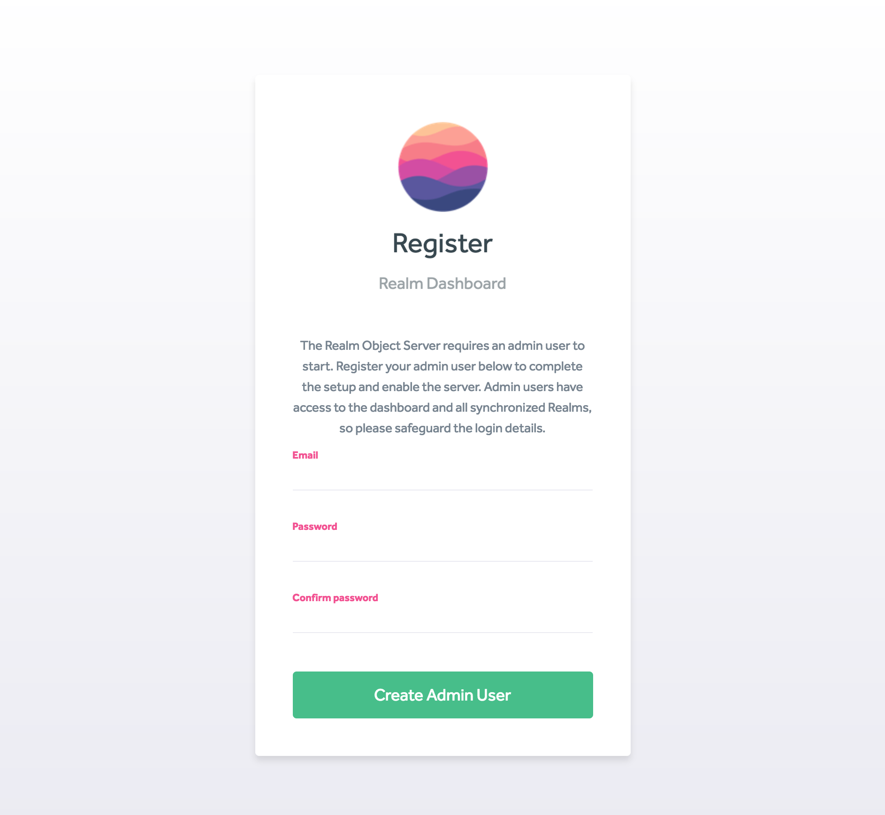

任意のメールアドレスとパスワードで Admin User を作成します。この時のユーザー名とパスワードを後で使用しますので、メモしておきましょう。ログインすると Dashboard や存在する Realm Database、User などが閲覧できます。

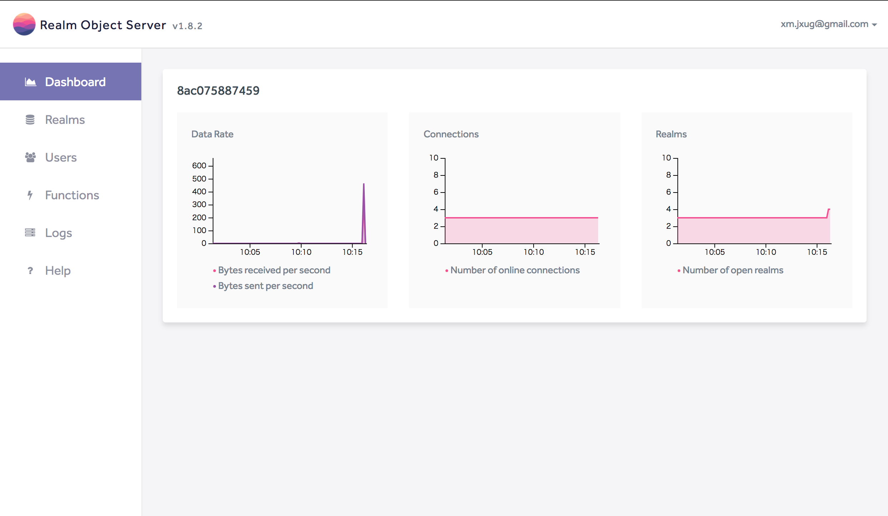

#### macOS の場合

Realm Object Server の起動を確認したら、`＜ルートディレクトリ＞/demo/RealmTasks/RealmTasks.app` を起動します。

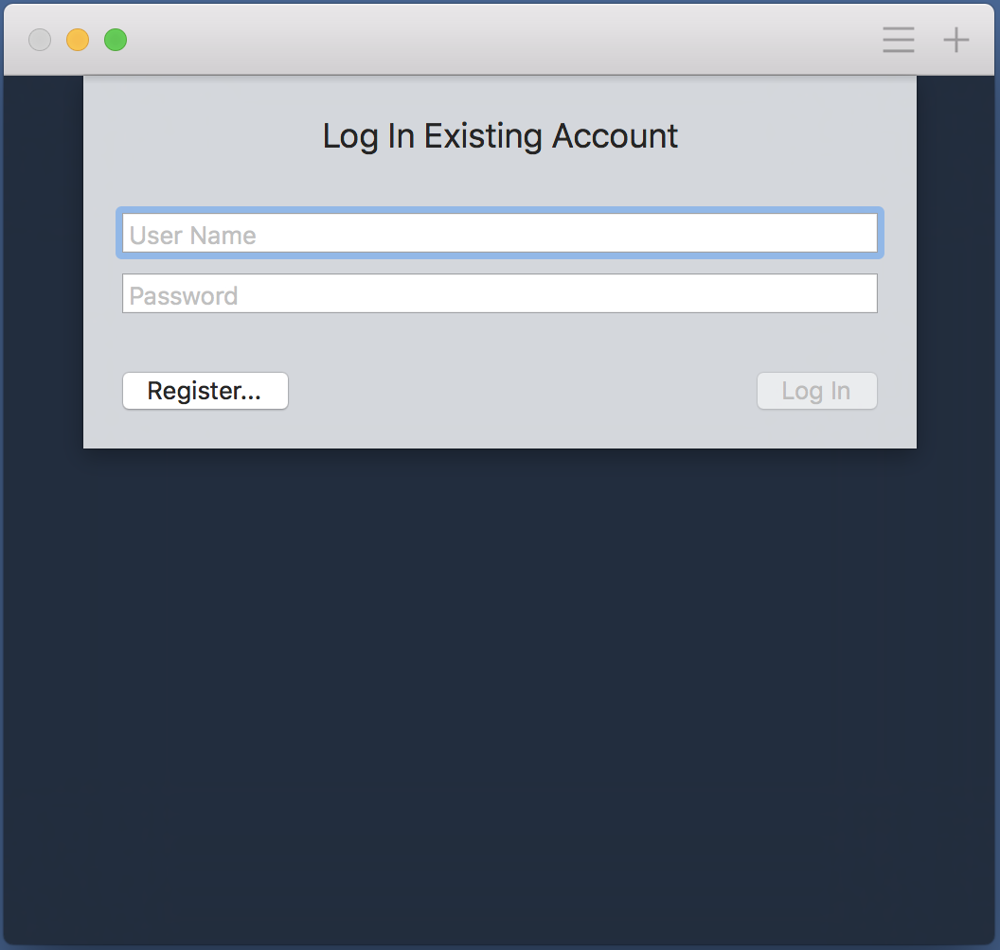

先ほど作成した Admin User でログインします。ログイン後、右上の「＋」ボタンからタスクを登録します。

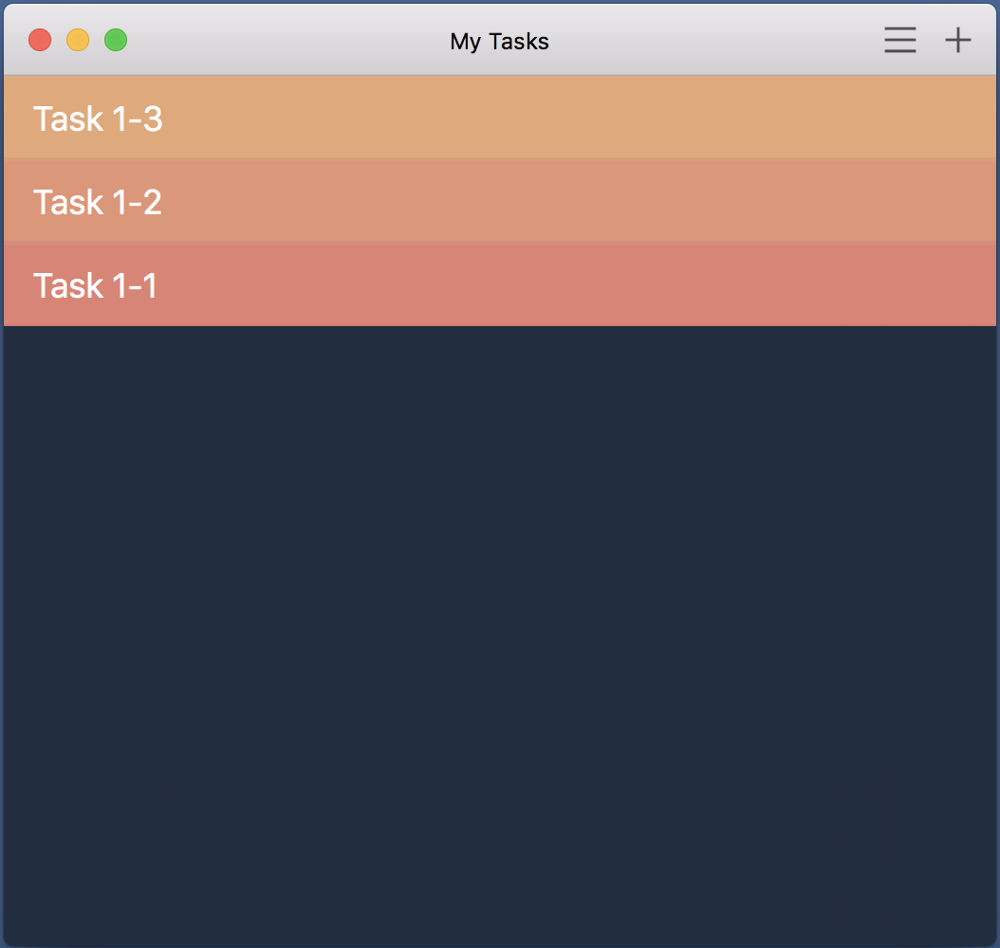

#### Windows の場合

Windows の場合は事前にビルドされたアプリが存在しないため、自前でビルドする必要があります。そのため、macOS と同じく[こちら](https://realm.io/docs/get-started/installation/mac/)から macOS Bundle をダウンロードします。ダウンロードした zip ファイルを「右クリック＞プロパティ」を選択し、「ブロックの解除」にチェックして「OK」をクリックします。

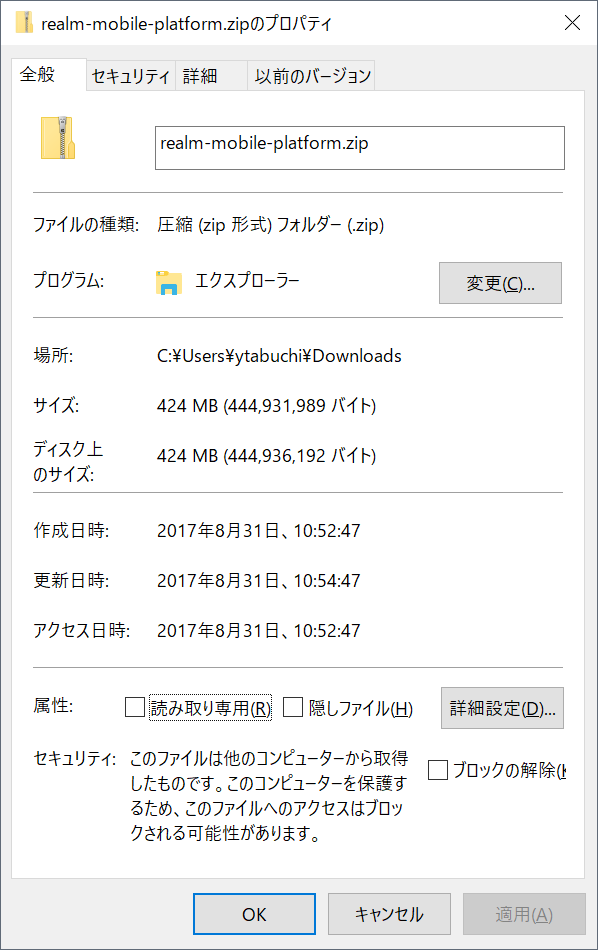

zip ファイル内の「demo\RealmTasks\RealmTasks Xamarin」フォルダを展開します。

展開されたフォルダ内の `RealmTasks.sln` をダブルクリックして Visual Studio を起動します。

ソリューションを右クリックして、「NuGet パッケージの復元」を行います。

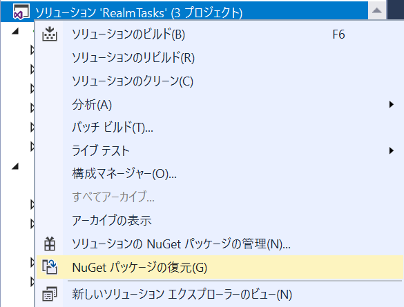

「RealmTask.Droid」プロジェクトを右クリックして、「スタートアッププロジェクトに設定」を選択します。

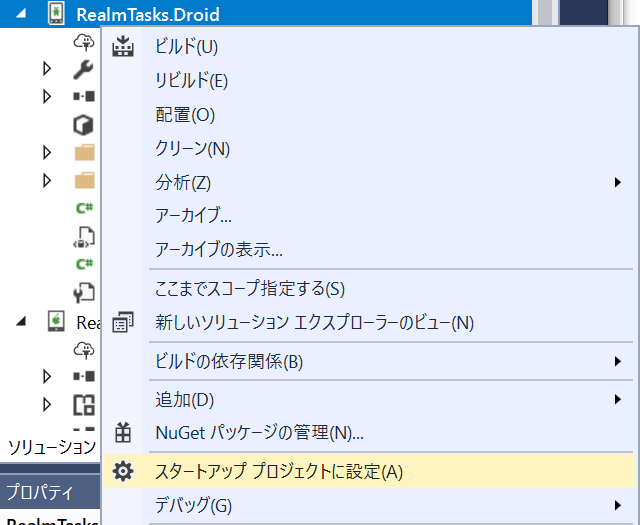

> エミュレーターへの配置がオンになっていない可能性がありますので、Visual Studio のメニューから「ビルド＞構成マネージャー」から構成マネージャーを開き、Android プロジェクトの「配置」にチェックを入れてください。<br />
<br />
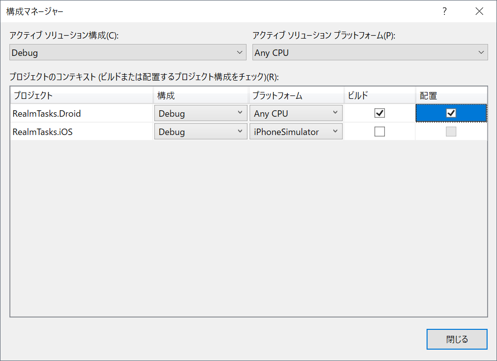

適切なエミュレーターまたはデバイスを選択し、「▶」ボタンでデバッグを開始します。

起動したら Realm Object Server の IP を適切な IP アドレスとポート番号に変更し、ユーザー名、パスワードでログインします。

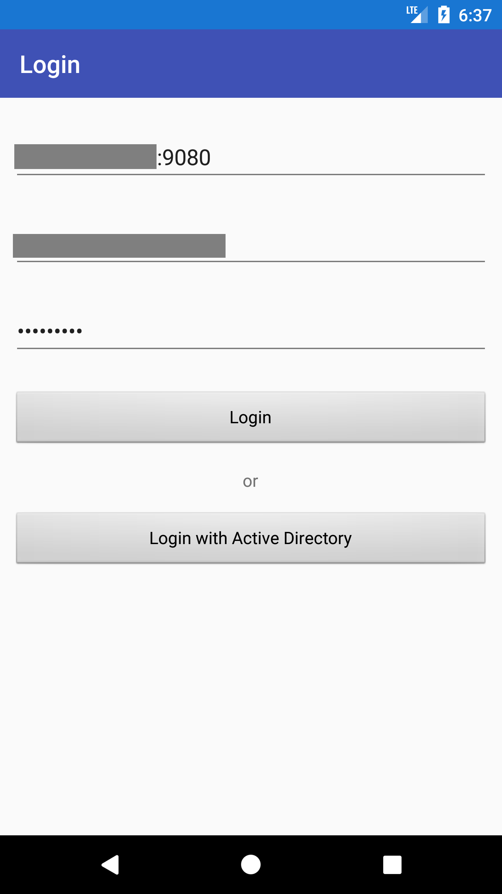

ログイン後、「My Tasks」の右側の 0（個）をクリックします。

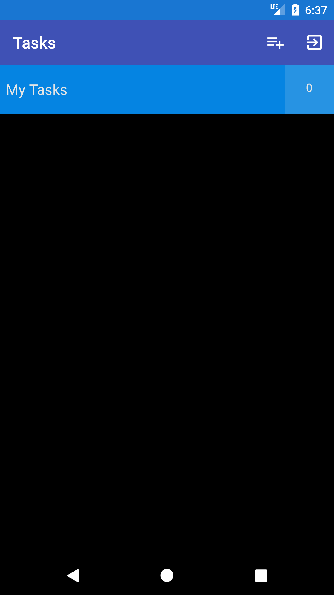

Task 入力欄で右上の＋ボタンからタスクをいくつか入力します。

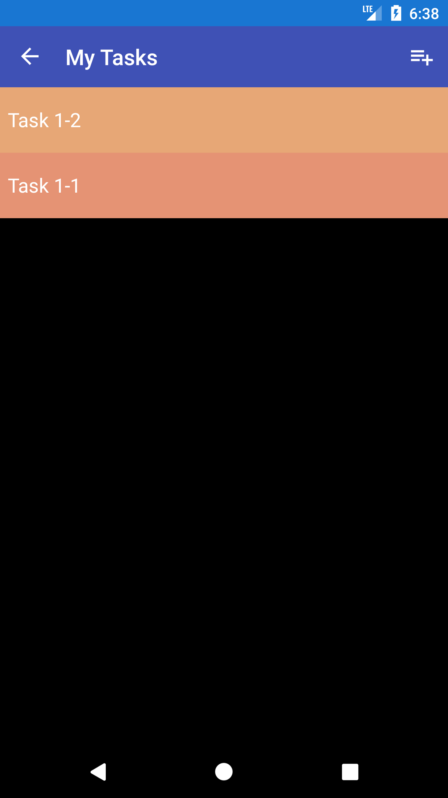

Windows 側の事前準備作業は少し長いですが以上です。

#### データ作成後

ブラウザの Realm タブから、データが登録されていることが分かります。


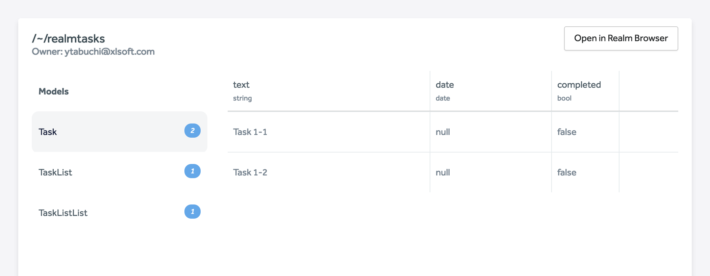


### Xamarin.Forms プロジェクトを作成

それでは本題のモバイルアプリの作成に入ってきます。最初に Xamarin.Forms のプロジェクトを作成します。

#### macOS の場合

プロジェクトを作成します。新規プロジェクトを作成して「Multiplatform＞App＞Black Forms App」です。

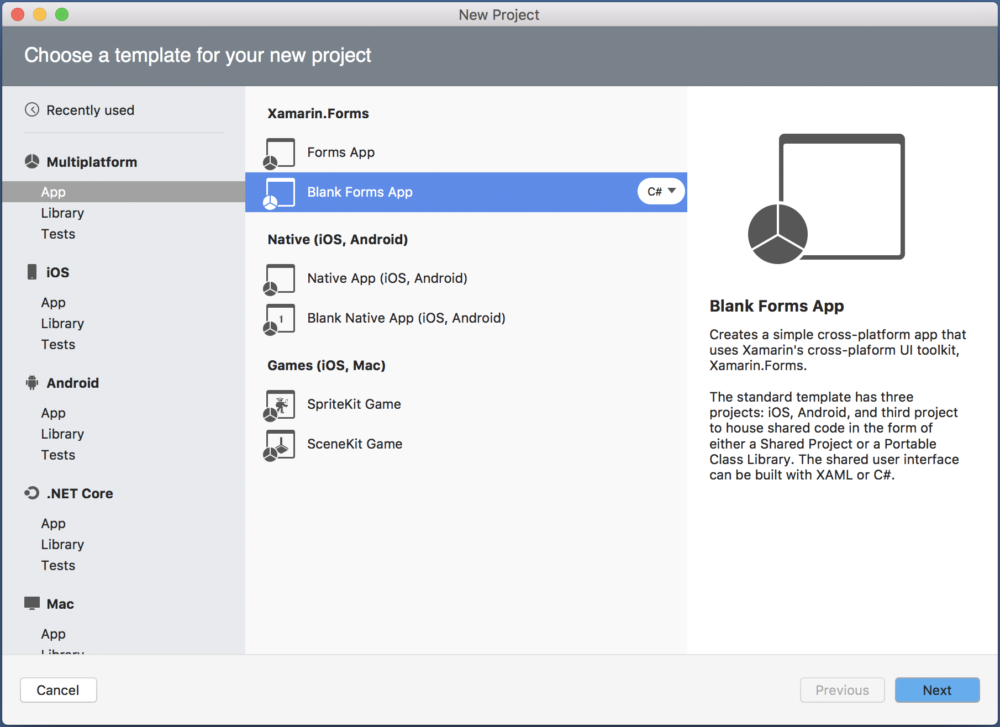

今回は名前を「RealmMobilePlatformSample」にしました。また、`ポータブルクラスライブラリ（Portable Class Library）` ではなく、`共有ライブラリ（Shared Library）` を使用しますのでご注意ください。


そのままプロジェクトを作成します。


最初に表示するページとして `RealmMobilePlatformSamplePage.xaml` と `RealmMobilePlatformSamplePage.xaml.cs` が作成されているはずです。今回は macOS を使用して開発して行きますので文中にはこのファイル名が出てきますが、Windows の場合は `MainPage.xaml` と `MainPage.xaml.cs` が作成されますので適宜読み替えてください。

#### Windows

プロジェクトを作成します。「Visual C#＞Cross-Platform＞Cross Platform App (Xamarin)」です。
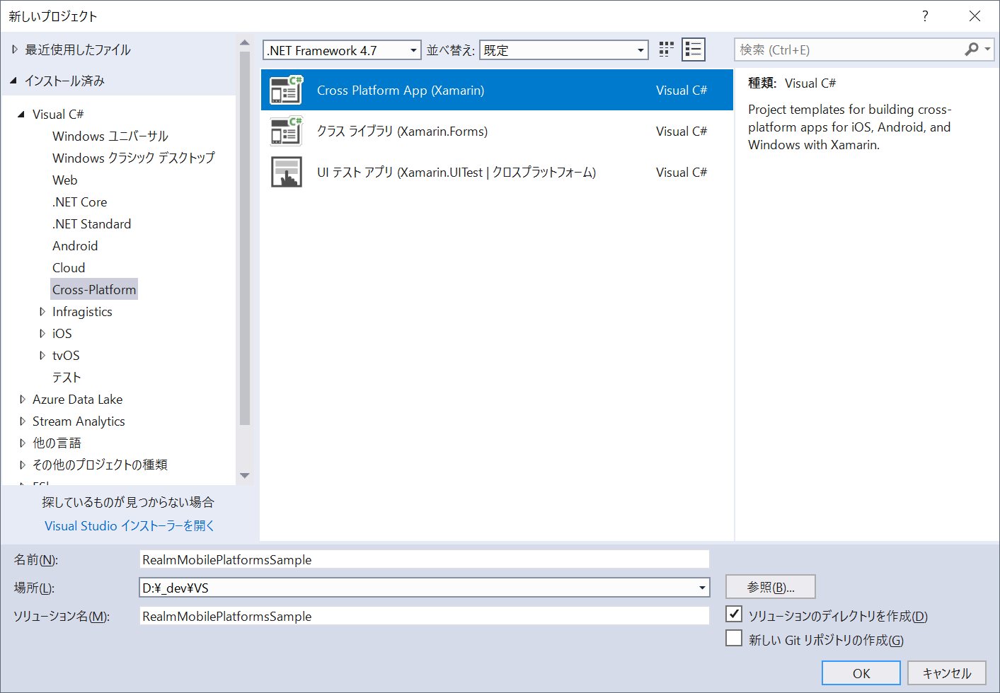

次の画面で「空のアプリ」「Xamarin.Forms」「共有プロジェクト」を選択した状態で「OK」をクリックしてプロジェクトを作成してください。

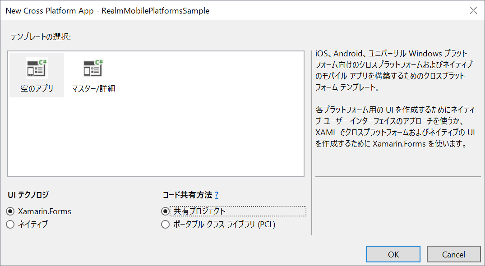

### 画面を作成

Xamarin.Forms のページを作成していきます。

`App.xaml.cs` の `MainPage` の指定を次のように `NavigationPage` で初期ページを呼び出しますように変更します。

```csharp
MainPage = new NavigationPage(new RealmMobilePlatformSamplePage());
```


### NuGet パッケージをインストール

NuGet パッケージをインストールします。

macOS では、iOS／Android のプロジェクトを右クリックして、「追加＞NuGet パッケージの追加」でパッケージマネージャーを起動します。Windows ではソリューションを右クリックして、「ソリューションの NuGet パッケージの管理」でパッケージマネージャーを起動します。

「Realm」で検索して、「Realm 1.6.0」（2017/08/28 時点）をインストールします。


少し時間が掛かるのと、ライブラリの使用許諾のダイアログが表示されるのでのんびり待ちましょう。

Realm ではデータベーススキーマはモデルクラスで実装します。

Xamarin.Forms プロジェクトに `TaskList.cs` ファイルを作成します。

```csharp
using System.Collections.Generic;
using Realms;
```

`using` を追加した後で、以下のクラスを作成します。`RealmObject` を継承するとモデルクラスになります。C# のアッパーキャメルに対応するよう、プロパティを作成し、サンプルの「realmtasks」の小文字のスキーマに `MapTo` 属性でマッピングします。

```csharp
public class TaskList : RealmObject
{
	[PrimaryKey]
	[Required]
	[MapTo("id")]
	public string Id { get; set; }

	[MapTo("text")]
	[Required]
    public string Title { get; set; } = string.Empty;

    [MapTo("items")]
    public IList<Task> Items { get; }
}

public class Task : RealmObject
{
    [MapTo("text")]
    [Required]
    public string Title { get; set; } = string.Empty;

    [MapTo("completed")]
    public bool Completed { get; set; } = false;
}
```

> Realm モデルの詳細は [Realm Xamarin ドキュメントの「モデル」の章](https://realm.io/jp/docs/xamarin/latest/#section-5) を参考にしてください。

### ListView の作成

まずは Ream ではなく、単純に ListView を表示し、データを追加する処理です。`ListView` の `Cell` の文字色を `Completed` プロパティが `true` なら透明度が 0.5、`false`（作成時）は透明度が １ になるようにします。Xamarin.Forms で実現するには、IValueConverter が必要です。

プロジェクトにクラス `OpacityConverter.cs` を作成し、次のコードで置き換えます。

```csharp
using System;
using System.Globalization;
using Xamarin.Forms;

namespace RealmMobilePlatformSample
{
    public class OpacityConverter : IValueConverter
    {
        public object Convert(object value, Type targetType, object parameter, CultureInfo culture)
        {
            if (value == null)
                return 1;

            return (bool)value ? 0.5 : 1;
        }

        public object ConvertBack(object value, Type targetType, object parameter, CultureInfo culture)
        {
            throw new NotImplementedException(); // 使わないので未実装です。
        }
    }
}
```

続いて `ListView` を作成します。`RealmMobilePlatformSamplePage.xaml` の `ContentPage` にタイトルプロパティを追加し、以下の `ListView` を追加します。（Windows の場合はクラス名が `MainPage` なので注意してください。）

```xml
<?xml version="1.0" encoding="utf-8"?>
<ContentPage xmlns="http://xamarin.com/schemas/2014/forms"
             xmlns:x="http://schemas.microsoft.com/winfx/2009/xaml"
             xmlns:local="clr-namespace:RealmMobilePlatformSample"
             x:Class="RealmMobilePlatformSample.RealmMobilePlatformSamplePage"
             Title="My Tasks">
    <ContentPage.Resources>
        <ResourceDictionary>
            <!-- Converter参照 -->
            <local:OpacityConverter x:Key="opacityConverter" />
        </ResourceDictionary>
    </ContentPage.Resources>
    <ListView x:Name="listView"
              ItemsSource="{Binding}">
        <ListView.ItemTemplate>
            <DataTemplate>
                <ViewCell>
                    <!-- OpecityプロパティにCompletedをバインドして、Converterでtrueなら1(不透明)、falseなら0.5(半透明)を返すようにします。-->
                    <Label Text="{Binding Title}"
                           Opacity="{Binding Completed, Converter={StaticResource opacityConverter}}"
                           VerticalOptions="Center"
                           Margin="15,0,0,0"/>
                </ViewCell>
            </DataTemplate>
        </ListView.ItemTemplate>
    </ListView>
</ContentPage>
```

続いてコードビハインド `RealmMobilePlatformSamplePage.xaml.cs` のクラスに `IList` のフィールドを作成し、初期データを追加します。次のようなコードになります。

```csharp
public partial class RealmMobilePlatformSamplePage : ContentPage
{
    IList<Task> _items = new List<Task>();

    public RealmMobilePlatformSamplePage()
    {
        InitializeComponent();

        _items.Add(new Task{ Title = "My First Task" });
        this.BindingContext = _items;
    }

	// 略
```

XAML で作成した ListView の `ItemsSource` プロパティに `{Binding}` を指定し、バインド対象として `BindingContext = _items` を指定すると各列のセルに `Task` データが表示されます。各セルは標準で用意されている `TextCell` などを使用しても良いですし、`ViewCell` で独自にセルを設定しても構いません。今回は、`Opacity` をバインドする必要があったため、`ViewCell` の中に `Label` を使用しました。

### データを作成する機能を追加

#### ダイアログを作成

データを入力するため、入力欄付きのダイアログを作成します。Xamarin.Forms のダイアログには入力欄付きのものは存在しないため、[Dependency Services](https://developer.xamarin.com/guides/xamarin-forms/application-fundamentals/dependency-service/) を使用して、iOS／Android のネイティブのダイアログを呼びだします。

##### Xamarin.Forms プロジェクトでの作業

最初に Xamarin.Forms のプロジェクトにインターフェースを作成します。

`IDisplayTextAlert.cs` インターフェースを作成し、次のメソッドを追加します。

```csharp
public interface IDisplayTextAlert
{
    Task<string> Show(string title, string message);
}
```

次に、`RealmMobilePlatformSamplePage.xaml` のコードビハインドに次のメソッドを追加します。

```csharp
private async void AddAsync(object sender, EventArgs e)
{
    var text = await DependencyService.Get<IDisplayTextAlert>().Show("New Task", "Enter Task Name");
    if (!string.IsNullOrEmpty(text))
    {
        _items.Add(new Task{ Title = text });
        var items = new List<Task>(_items);
        this.BindingContext = items;
    }
}
```

`DependencyService.Get<IDisplayTextAlert>().Show()` の部分がインターフェース経由で iOS／Android のコードを呼び出す箇所です。

##### iOS／Android プロジェクトでの作業

iOS プロジェクトに移動して、`DisplayTextAlert.cs` クラスを作成します。次のコードで置き換えます。

```csharp
using System;
using Xamarin.Forms;
using RealmMobilePlatformSample.iOS;
using UIKit;
using Foundation;
using System.Threading.Tasks;

[assembly: Dependency(typeof(DisplayTextAlert))]

namespace RealmMobilePlatformSample.iOS
{
    public class DisplayTextAlert : IDisplayTextAlert
    {

        public async Task<string> Show(string title, string message)
        {
            var text = await ShowDialog(title, message);
            return text;
        }

        private Task<string> ShowDialog(string title, string message)
        {
            var comp = new TaskCompletionSource<string>();

            var alert = UIAlertController.Create(title, message, UIAlertControllerStyle.Alert);
            alert.AddTextField((field) =>
            {
                field.Placeholder = "Task name";
            });
            alert.AddAction(UIAlertAction.Create("Add", UIAlertActionStyle.Default, x =>
            {
                comp.SetResult(alert.TextFields[0].Text);
            }));

            UIApplication.SharedApplication.KeyWindow.RootViewController.PresentViewController(alert, true, null);

            return comp.Task;
        }
    }
}
```

AddAsync ボタンが押された時に return を返したかったので、[@amay077](https://twitter.com/amay077) さんの [UIAlertController を async/await 対応させて便利に使う \- Qiita](http://qiita.com/amay077/items/0a3fa3dfac7f29a2807d) を参考にしました。

Dependency Services のコード内では PresentViewController は `UIApplication.SharedApplication.KeyWindow.RootViewController.PresentViewController` でアクセスできます。

Android プロジェクトを開き、同様に `DisplayTextAlert.cs` クラスを追加します。
iOS と同様に以下のコードで置き換えます。

```csharp
using System;
using System.Threading.Tasks;
using Xamarin.Forms;
using RealmMobilePlatformSample.Droid;
using Android;
using Android.Widget;
using Android.App;

[assembly: Dependency(typeof(DisplayTextAlert))]

namespace RealmMobilePlatformSample.Droid
{
    public class DisplayTextAlert : IDisplayTextAlert
    {
        public Task<string> Show(string title, string message)
        {
            var text = ShowDialog(title, message);
            return text;
        }

        private Task<string> ShowDialog(string title, string message)
        {
            var comp = new TaskCompletionSource<string>();

            var textDialog = new AlertDialog.Builder(Xamarin.Forms.Forms.Context);
            var editText = new EditText(Xamarin.Forms.Forms.Context)
            {
                Hint = "Task name"
            };
            textDialog.SetTitle(title);
            textDialog.SetMessage(message);
            textDialog.SetView(editText);
            textDialog.SetNegativeButton("Add", (sender, e) =>
            {
                comp.SetResult(editText.Text);
            });
            textDialog.Show();

            return comp.Task;
        }
    }
}
```

Dependency Services のコード内で現在の `Context` は `Xamarin.Forms.Forms.Context` でアクセスできます。

#### ダイアログの呼び出しを実装

Xamarin.Forms プロジェクトでの作業に戻ります。`NavigationPage` の右上に＋ボタンを追加してダイアログを呼び出します。[Page](https://developer.xamarin.com/api/type/Xamarin.Forms.Page/) クラスの `ToolbarItems` プロパティを使用します。

`RealmMobilePlatformSamplePage.xaml` の `ContentPage.Resources` の後に以下を追加します。

```xml
<ContentPage.ToolbarItems>
    <ToolbarItem Text="＋" Clicked="AddAsync"/>
</ContentPage.ToolbarItems>
```

`ToolbarItem` のプロパティは[公式ドキュメント](https://developer.xamarin.com/api/type/Xamarin.Forms.ToolbarItem/)を参照してください。

次にコードビハインド `RealmMobilePlatformSamplePage.xaml.cs` の初期データを追加する以下のコードを削除します。

```csharp
// これを削除
_items.Add(new Task{ Title = "My First Task" });
```

ここで一度ビルドして、AddAsync ボタンとダイアログが正常に動作するか確認しましょう。

無事ダイアログで入力したデータが ListView に表示されていれば次に進みます。

### Realm への追加と同期処理の実装

実際に Realm にデータを追加していきましょう。コードビハインド `RealmMobilePlatformSamplePage.xaml.cs` を開き、using を追加します。

```csharp
using Realms;
using Realms.Sync;
```

 クラス内の `_items` フィールドの後に以下のフィールドを追加します。

```csharp
Realm _realm;
IDisposable _notificationToken;
```

`AddAsync` メソッドの下に `SetupRealmAsync` メソッドを追加します。サンプルのソースコードでは、`.gitignore` に指定して公開されないようにした `Secrets.cs` に情報を記載しています。

```csharp
private async void SetupRealmAsync()
{
    var username = "xxxxx";
    var password = "xxxxx";
    var serverIp = (Device.RuntimePlatform == Device.Android) ? "10.0.2.2:9080" : "127.0.0.1:9080";
}
```

> `serverIp` は macOS で iOS Simulator と Android Emulator からローカルホストの Realm Object Server にアクセスする場合の IP です。iOS Simulator からは `127.0.0.1`、Android Emulator からは `10.0.2.2` でローカルホストの IP にアクセスできます。実機にデプロイする場合や LAN 内の別マシン や Azure／AWS に立てた Realm Object Server にアクセスする場合はその Realm Object Server の IP アドレスとポートを指定します。

コンストラクターの `InitializeComponent` の後で `SetupRealmAsync` メソッドの呼びだしを追加します。

```csharp
public RealmMobilePlatformSamplePage()
{
    InitializeComponent();

    SetupRealmAsync();

    this.BindingContext = _items;
}
```


続いて Realm Object Server へのアクセスを実装していきます。`SetupRealmAsync` メソッドに次のコードを追加します。

```csharp
private async void SetupRealmAsync()
{
    // 略

    User user = null;
    try
    {
        user = User.Current;  // if still logged in from last session
    }
    catch (Exception) { }

    try
    {
        if (user == null)
        {
            var credentials = Credentials.UsernamePassword(username, password, createUser: false);
            user = await User.LoginAsync(credentials, new Uri($"http://{serverIp}"));
        }
        var config = new SyncConfiguration(user, new Uri($"realm://{serverIp}/~/realmtasks"));
        _realm = Realm.GetInstance(config);
    }
    catch (Exception)
    {
        return;
    }

    // 略
}
```

最初に `Realms.Sync.User` クラスの `Current` メソッドで既にログインしている場合にユーザーを取得する処理があります。（[Realtime Databases with the Realm Mobile Platform | Xamarin Blog](https://blog.xamarin.com/shared-drawing-with-the-realm-mobile-platform/) のコードを参考（パクリ）にしています。）

その後、`Realm.Sync.Credentials` クラスの `UsernamePassword` メソッドを使用してクレデンシャルを作成し、`Realm.Sync.User` クラスの `LoginAsync (Credentials credentials, Uri serverUrl)` メソッドの引数で渡してあげます。最後に、`Realm.GetInstance(config)` で Realm Object Server への接続をインスタンス化します。


その後、初期タスクとして Realm Object Server からデータを取得して、取得したデータで ListView のバインディングを再指定する `UpdateList` メソッドを作成します。

```csharp
private void UpdateList()
{
    if (_realm.All<TaskList>().FirstOrDefault() != null)
        _items = _realm.All<TaskList>().FirstOrDefault().Items;
    this.BindingContext = _items;
}
```

再度 `SetupRealmAsync` に戻り、処理を追加していきます。

`user` が取得できていれば、先ほど作成した `UpdateList` メソッドを呼び出します。その後、Realm Object Server 側で変更があった際に発行される `notificationToken` を受け取った際の処理 `SubscribeForNotifications` 内でも `UpdateList` メソッドを呼び出します。`SetupRealmAsync` メソッドの最後に以下のコードを追加します。

```csharp
if (user != null)
{
    UpdateList();
    _notificationToken = _items.SubscribeForNotifications((sender, changes, error) => UpdateList());
}
```

ListView を更新するだけだった `AddAsync` メソッドを以下のように書き換えます。

```csharp
var text = await DependencyService.Get<IDisplayTextAlert>().Show("New Task", "Enter Task Name");
if (!string.IsNullOrEmpty(text))
{
    try
    {
        _realm.Write(() =>
        {
            _items.Insert(_realm.All<TaskList>().FirstOrDefault().Items.Count(), new Task
            {
                Title = text
            });
        });
    }
    catch (Exception ex)
    {
        System.Diagnostics.Debug.WriteLine(ex);
    }
}
```

現時点でのコードビハインド `RealmMobilePlatformSamplePage.xaml.cs` は以下のコードになっているはずです。

```csharp
using System;
using System.Linq;
using System.Collections.Generic;
using System.Threading.Tasks;
using Xamarin.Forms;
using Realms;
using Realms.Sync;

namespace RealmMobilePlatformSample
{
    public partial class RealmMobilePlatformSamplePage : ContentPage
    {
        IList<Task> _items = new List<Task>();
        Realm _realm;
        IDisposable _notificationToken;

        public RealmMobilePlatformSamplePage()
        {
            InitializeComponent();

            SetupRealmAsync();

            this.BindingContext = _items;
        }

        private async void AddAsync(object sender, EventArgs e)
        {
            var text = await DependencyService.Get<IDisplayTextAlert>().Show("New Task", "Enter Task Name");

            if (!string.IsNullOrEmpty(text))
            {
                try
                {
                    _realm.Write(() =>
                    {
                        _items.Insert(_realm.All<TaskList>().FirstOrDefault().Items.Count(), new Task
                        {
                            Title = text
                        });
                    });
                }
                catch (Exception ex)
                {
                    System.Diagnostics.Debug.WriteLine(ex);
                }
            }
        }

        private async void SetupRealmAsync()
        {
            var username = "xxxxx";
            var password = "xxxxx";
            var serverIp = "xxxxx";

            User user = null;
            try
            {
                user = User.Current;  // if still logged in from last session
            }
            catch (Exception) { }

            try
            {
                if (user == null)
                {
                    var credentials = Credentials.UsernamePassword(username, password, createUser: false);
                    user = await User.LoginAsync(credentials, new Uri($"http://{serverIp}"));
                }
                var config = new SyncConfiguration(user, new Uri($"realm://{serverIp}/~/realmtasks"));
                _realm = Realm.GetInstance(config);
            }
            catch (Exception)
            {
                return;
            }

            if (user != null)
            {
                UpdateList();

                _notificationToken = _items.SubscribeForNotifications((sender, changes, error) => UpdateList());
            }
        }

        private void UpdateList()
        {
            if (_realm.All<TaskList>().FirstOrDefault() != null)
                _items = _realm.All<TaskList>().FirstOrDefault().Items;
            this.BindingContext = _items;
        }
    }
}
```


最後に iOS プロジェクトの設定をします。iOS アプリは TLS ではないネットワークアクセスをするので、`Info.plist` に「App Transport Security」の設定が必要です。

`Info.plist` を右クリックして、任意のテキストエディタで開き、最後の `</dict>` の前に次を追加します。Windows の場合は「ファイルを開くアプリケーションの選択＞XML (テキスト) エディター」を選択します。

```xml
<key>NSAppTransportSecurity</key>
<dict>
    <key>NSAllowsArbitraryLoads</key>
    <true/>
</dict>
```

おめでとうございます！これで Realm Object Server と同期する最初のアプリが完成しました！

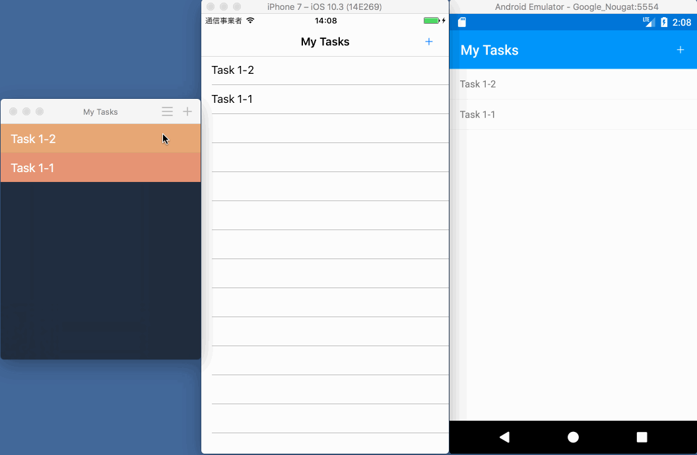

### タスクの削除をサポート

まずは動くものができましたが、引き続き処理を追加して行きます。`Context Actions` を使ってスワイプ（iOS）と長押し（Android）でタスクの削除を実装します。

`RealmMobilePlatformSamplePage.xaml` を開き、`ListView` の `ViewCell` 内に `Context Actions` を作成します。

```xml
<ViewCell.ContextActions>
    <MenuItem Clicked="OnDelete" Text="Delete" CommandParameter="{Binding}" IsDestructive="True" />
</ViewCell.ContextActions>
```

`CommandParameter` にバインドすることで、Delete したアイテム（ここでは Task）を取得できます。

コードビハインド `RealmMobilePlatformSamplePage.xaml.cs` を開き、`AddAsync` メソッドの後に以下のメソッドを追加します。

```csharp
private void OnDelete(object sender, EventArgs e)
{
    var mi = ((MenuItem)sender);
    var item = mi.CommandParameter as Task;

    try
    {
        _realm.Write(() =>
        {
            _items.Remove(item);
        });
    }
    catch (Exception ex)
    {
        System.Diagnostics.Debug.WriteLine(ex);
    }
}
```

まず `MenuItem` を取得し、その `CommandParameter` を取得して、`Realm.Write` のアクションで `Remove` メソッドに `Task` を渡します。

### タップすることでタスクの完了にトグルする処理をサポート

アイテムをタップすると、完了（して一番最後に移動）、未完了をトグルする処理を追加します。

最初に ListView に `ItemSelected` イベントを追加します。

```xml
// 略
<ListView x:Name="listView"
          ItemsSource="{Binding}"
          ItemSelected="OnSelect">
    <ListView.ItemTemplate>
    // 略
```

次にコードビハインド `RealmMobilePlatformSamplePage.xaml.cs` で `OnDelete` メソッドの後に `OnSelect` メソッドを追加します。

```csharp
private void OnSelect(object sender, SelectedItemChangedEventArgs e)
{
    if (e.SelectedItem == null)
    {
        return;
    }

    var item = e.SelectedItem as Task;

    try
    {
        _realm.Write(() =>
        {
            if (!item.Completed)
            {
                //completedにして一番下に
                item.Completed = true;
                _items.Move(item, _items.Count() -1);
            }
            else
            {
                //de-completeにしてcompletedの一個上に
                item.Completed = false;
                _items.Move(item, _items.Count() - _items.Count(x => x.Completed == true) - 1);
            }
        });
    }
    catch (Exception ex)
    {
        System.Diagnostics.Debug.WriteLine(ex);
    }
}
```

では動かしてみましょう！


お疲れ様でした！これで全てのチュートリアルは終了です。
